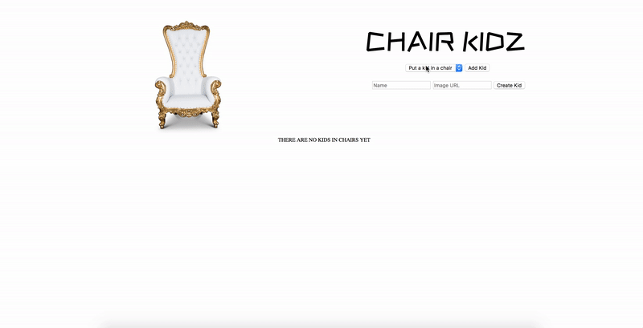

# Welcome to Chair Kidz!

A vanilla JavaScript app that is truly quite random...fork and clone this repository and let's get started!

We will be practicing making POST, PATCH, and DELETE requests to an API, and making sure updated and persisted data on the backend reflects on the front end so that a page refresh does not alter the state of the application.

NOTE: this challenge is significantly harder than the code challenge, and is meant to be thorough practice!

## Deliverables



* As a user, when the page loads, I should see a list of `kidz` in a drop-down list. Selecting a kid and pressing the `Add Kid` button should place the kid in a chair on the DOM. A patch request should be sent to the backend, resulting in changing that kid'z `in_chair` attribute to `true`. The styling has been done for you, and the resulting HTML for a `Kid` should look as follows:

```html
<div id=3-container class="kid-chair-container">
  
  <br>
  <br>
  <div data-id=3 class="attribute">
  Chris
  <br>
  Score: 0
  <br>
  <a class="vote-down" href="#">Vote Down</a> | <a class="vote-up" href="#">Vote Up</a>
  <br>
  <a class="hide" href="#">Hide</a>
  </div>
</div>
```
 
 * As a user, voting up or down on a kid will alter their `vote` count on the DOM as well as on the backend. We do this by sending a PATCH request to the correct URL and providing the `kid_id` AS WELL AS as the direction of the vote ("up" or "down"). 
 
* When a kid'z `vote` count gets to 5, they should take a seat at the throne, replacing the previous kid on the throne if there was one. A patch request should be sent to the correct URL that will set the kid'z `throne` attribute to `true`, and will automatically set the previous kid in the throne's attribute to `false`. While a kid is in the throne, they cannot be voted on. 


* If a kid'z vote hits -5, they will be deleted from the DOM AS WELL AS the database, requiring a DELETE request sent to the backend that requires the `kid_id`.

 * As a user, when I click the `Hide` link under a kid, the kid should disappear from the DOM and re-appear back inside the dropdown list. Their `in_chair` attribute should be changed to `false` using a PATCH request to the appropriate URL.

 

 * As a user, I can use the form to create a new kid. The new kid will automatically appear on the DOM in a chair and will be added to the database.

## Implementation Notes

### The Frontend

All of your code will be written in the index.js file located in the `chair-kidz-frontend` folder of this repository. But the backend will need some setup. See following instructionsL:

### The API

Navigate into the `chair-kidz-backend` folder in this repository, run `bundle install`, then `rails db:setup` to create your database and the starting seeded information, and then `rails s` to get the server going. You will be making all requests to your locally hosted server at port 3000.

#### GET `/kids`

Will return all the kids currently in the database.

Example response:
```json
  {
    "data": [
    {
      "id": 1,
      "type": "Kid",
      "attributes": {
        "name": "Chris",
        "in-chair": true,
        "throne": false,
        "votes": -2,
        "img-url": "http://somelink.com/somepic.jpg"
      }
    }
    {
      "id": 2,
      "type": "Kid",
      "attributes": {
        "name": "Evans",
        "in-chair": false,
        "throne": true,
        "votes": 4,
        "img-url": "http://somelink.com/somepic.jpg"
    }
  }]
}
```

#### POST `/kids`

Accepts a key of a `name` AND a key of `img_url` to create a new `Kid` instance, and returns the create `Kid` instance.

```
Required Headers
{
  'Content-Type': 'application/json',
  'Accept': 'application/json'
}

Required Keys

{
  kid_id: <add kid_id here>
  vote: <"up" or "down" here>
}
```

#### PATCH `/kids/chair`, `kids/throne`

Accepts a key of a `kid_id` and switches that kid'z `in_chair` or `throne` attribute to be the opposite of what it was before. NOTE: When a kid'z `throne` status is changed, their `votes` attribute is automatically reset to 0.

```
Required Headers
{
  'Content-Type': 'application/json',
  'Accept': 'application/json'
}

Required Keys

{
  kid_id: <add kid_id here>
}

```

A successful request will return the updated `Kid` instance.

#### PATCH `/kids/vote`

Accepts a key of a kid_id AND a direction of a vote ("up" or "down"), and returns the updated `Kid` instance.

```
Required Headers
{
  'Content-Type': 'application/json',
  'Accept': 'application/json'
}

Required Keys

{
  kid_id: <add kid_id here>
  vote: <"up" or "down" here>
}
```

### Considerations

You are free to solve this in any way you choose. It is not required that you have ES6 classes or use Object Orientation. If you want to challenge yourself, build the app using optomistic rendering principles.
